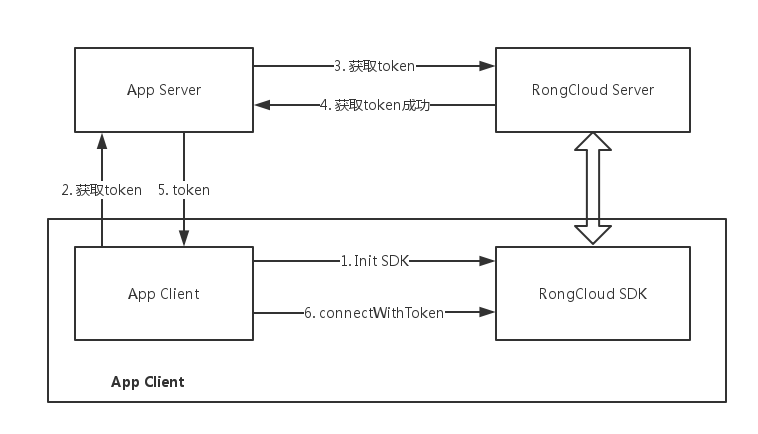
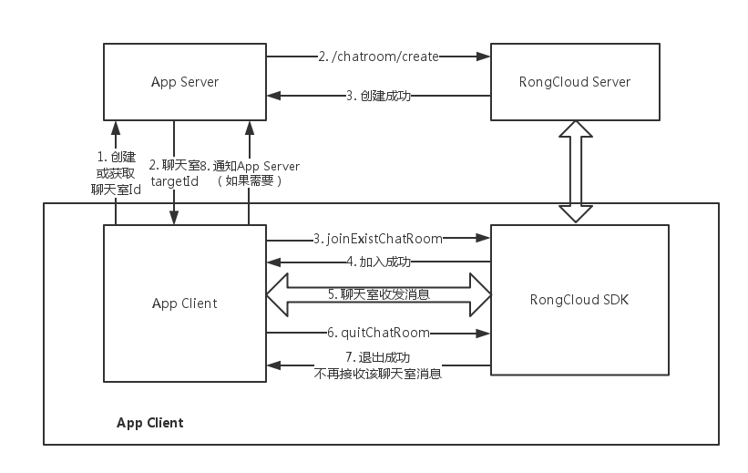
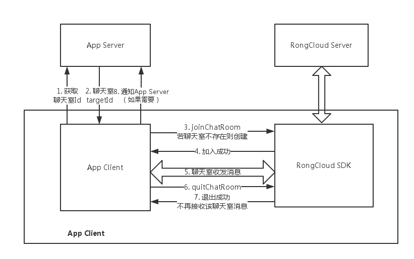

# Android 直播聊天室 开发指南

## 基本概念

### 融云直播聊天室介绍

融云直播聊天室，是专门为视频直播业务提供的一个产品。主要特点是：

1. 可以支持无人数上限的直播聊天室；
2. 支持海量消息的并发，消息速度极快；
3. 并可以方便的为直播聊天室实现弹幕、点赞、礼物、成员进入等消息通讯功能。
	
以上可以极大的节约视频直播产品的开发和运营成本。目前融云承担的日消息分发量峰值已经超过 1000 亿。

### 解决方案主要构成

融云的视频直播聊天室方案，由两部分构成，视频直播 SDK 和融云聊天室 SDK。后者由融云提供，前者你使用自己的推流和拉流来实现，或者使用第三方成熟的 SDK 来实现。融云的开源视频直播室 App 里整体方案为您打包了金山云视频 SDK，同时我们也支持七牛，乐视，阿里，UCldou等视频云 SDK。

* 视频直播 SDK
	* 主播端
	
		主播端使用的推流 SDK，主播需要把摄像头采集的视频源做编码，然后推到视频直播云上。
	
	* 观众端
	
		观众端使用的是拉流 SDK，观众需要的是把视频从服务端拉倒本地，做解码，并展示到手机终端上。观众端还必须包括一个视频播放器。
	
	您也可以把以上的主播端和观众端打包到同一个 App 里，同时提供主播推流功能，又提供观众端拉流观看的功能。融云直播聊天室对于以上几种模式的支持都是完全相同的。

* 融云聊天室 SDK
	* IMLib
		
		IMLib 是融云的 SDK 的一个产品组件，提供的是基础的通信能力，当使用融云聊天室的时候，您只需要简单调用初始化，连接，加入聊天室，发送消息等功能。	
	
	* 直播聊天室 App 开源代码
	
		基于融云的 IMlib SDK，融云把常见的视频直播聊天室的常用功能封装成了一个 App，Seal Live。在这个 App 内，融云实现了登录，连接，直播界面的显示，输入框，发送接收消息的处理流程，我们建议您直接使用这部分代码，可以大大的减轻整个聊天室 UI 的开发工作。
	

### 常见问题 Q&A

* 是否有系统瓶颈和任何数量限制？

	融云直播聊天室不存在任何系统瓶颈，系统可以实现平滑的横向扩展，支持任意规模的同时在线用户消息分发。

* 消息并发量过大是否会导致服务崩溃？

	当遇到直播高峰，用户数与消息量超出系统承载能力时，系统会自动根据预先设定的规则对消息进行抛弃，优先抛弃掉低优先级消息，确保系统能够稳定运行，不会影响用户体验。
	
* 什么是消息分级与消息抛弃模型

	当聊天室内人数众多，消息量会变得非常大，这时可能会出现服务端超过预设承载能力或者分发的消息量超过客户端消息接收能力的情况，这时，就需要引入消息分级机制。
	
	融云并没有对任何消息进行抛弃，但是在消息量极大的情况下，比如1万人到百万左右的聊天室内，消息并发量极大的情况下，每个用户端能收发到的消息和体验已经很悠闲，因此消息抛弃指的是确保用户端总是能收到最重要的消息，因此不重要的消息看起来就像是被抛弃了。	

	在开发过程中，除官方的普通文本消息之外，开发者需要针对不同的消息类别定义不同的消息类型，以便通过消息的 ObjectName 设置消息分级。目前融云支持两级消息分类，分别是高优先级消息和低优先级消息。当发生消息抛弃行为时，优先抛弃低优先级消息。

	针对主播的消息，可以通过聊天室内用户白名单机制，将主播添加到白名单以确保主播消息不会被抛弃掉。

	自定义消息文档请参见：http://www.rongcloud.cn/docs/android_architecture.html 和 http://www.rongcloud.cn/docs/ios_architecture.html 	
	
* 直播聊天室的成本结构是如何的？

	直播聊天室的成本结构主要包括两大部分：
	
	1、服务器成本：主要包括维持同时现在用户长连接的连接服务器成本和负责分发消息的消息服务器成本，还有极少量的基础功能服务器成本。
	
	2、流量成本：流量成本决定于系统最终分发的消息量和消息尺寸。为了降低成本，开发者在设计时要注意控制消息序列化之后的尺寸，也可以从业务角度优化消息量。注意：消息流量是 IDC 流量，与直播视频流使用的 CDN 流量成本有巨大差别，不可放在一起比较。

* 我还需要关注如何优化消息吗？

	是的。聊天室作为一种特殊的场景，其消息分发量是海量的，比如 1 万人的聊天室，如果实时在线的人每个人同时发送1条消息，那消息分发量就是 1万 X 1万 等于 1 亿的消息并发。因此您需要注意控制用户端发送消息的频率。比如常见的点赞消息，用户端可以非常快速的点赞，但建议你做成消息归并，每 1 秒再发送一条消息，每条点赞消息内携带一个数字，这个数字表示在 1 秒内该用户点赞了几次。这样可以大大减少消息并发量。

### 开始集成融云 IM 需要了解的概念
* appKey
* token
* userId
* 会话
	* conversationType
	* targetId
* 消息
	* 消息类型

## 融云 IM 是如何运转、如何与 App 交互的

使用融云 IM 聊天室之前，必须要先初始化 SDK 并建立与融云服务器的连接。

connect 成功之后，融云提供两种加入聊天室的方式。

1. App Server 创建聊天室，客户端调用 joinExistChatRoom 加入聊天室。

2. App Server 只管理聊天室 Id列表，客户端调用joinChatRoom加入聊天室，如果聊天室不存在则自动创建。

> 融云 Sever API 也提供了将用户加入聊天室的接口，但是不要通过此接口将普通用户加入聊天室中，否则会导致聊天室自动保活的功能失效。
> 一些记录功能的账号可以通过 Server API /chatroom/join 接口加入聊天室，但是普通用户需要调用 SDK 的 joinExistChatRoom 或 joinExistChatRoom 加入聊天室。

### App 服务器端需要做什么？
* 管理用户体系和融云 userId 的映射关系
	
	> 融云不维护用户体系和好友关系，App 需要为您用户体系中的每个用户和融云的 userId 建立一一对应的映射关系。之后就可以根据 userId，加入、退出聊天室并收发消息。
	
* 实现从融云获取 token 的逻辑
* 根据App的产品逻辑，维护每个聊天室的信息和聊天室列表

### App 服务器还可以做什么？
* 创建、销毁聊天室
* 查询聊天室的信息
* 查询聊天室中的用户列表
* 用户禁言、封禁
* 敏感词过滤
* 消息分级
* 全球节点

### App 客户端需要做什么?
* 初始化 SDK
* 加入、退出聊天室
* 初始化视频播放器（多家合作厂家可选）
* 收发消息
* 文字、表情、点赞、鲜花等编辑、显示
	
> 其中，App以上部分的功能和UI都已经实现并开源，可以开箱即用也可以随意定制。

### App 客户端还可以做什么？
* 自定义任意消息及其显示样式（也可以不显示）
* 插入而不发送消息
* 监听消息收发，App 可以按自己需求控制逻辑和 UI
* 后期可以很方便地集成 IMKit，快速扩展出单聊、群聊、黑名单、客服、VoIP 等功能。

## Android 直播聊天室Demo 说明
融云直播聊天室 Demo 使用了 IMLib SDK 和第三方的播放 SDK。前者提供聊天消息相关的基础服务，后者则负责视频播放控制。开源部分主要为 UI 的绘制及 SDK 的使用控制逻辑。

IMLib 是不含界面的基础 IM 通讯能力库，封装了通信能力和会话、消息等对象。引用到工程中后，需要开发者自己实现 UI 界面，相对较轻量，适用于对 UI 有较高订制需求的开发者。

直播聊天室 Demo：[点击下载](https://github.com/rongcloud/demo-app-imlib-live-chatroom-android)

### IMLib SDK 集成说明
1. 下载 IMLib SDK：[点击下载](http://www.rongcloud.cn/downloads)

2. SDK 目录结构说明:
	* libs 目录 - native so 库，目前支持 armeabi（含v7及64位），以及 x86 平台。如有其它平台需求，请联系客服。
	* res 目录- 配置及资源文件。
	* build.gradle - gradle 配置相关，可再此定义编译版本等信息。
	* AndroidManifest.xml - SDK 配置文件，可查看 SDK 所需的安卓权限等信息。

3. 导入 IMLib SDK：
	* 将下载的 IMLib 文件夹拷贝到工程根目录，为方便使用可更名为 imlib。
	* 在 settings.gradle 里加入 imlib 库引用，如：

			include ':app', ':imlib'
	* 在主工程 build.gradle 文件的 dependencies 中加入 imlib 库引用，如：
	
			compile project(':imlib')

至此 IMLib SDK 集成完毕，可在主工程里直接调用其接口。

### IMLib SDK 使用说明
1. SDK 初始化：

	在使用 IMLib 接口前，需要对其做初始化操作，只需调一次即可。建议在继承 Application 类的 onCreate 方法中调用。 接口说明如下：

		/**
		* @param context 传入 Application 类的 Context。
		* @param appKey  融云注册应用的 AppKey。
		*/
		public static void init(Context context, String appKey);

2. 注册消息监听：

	在连接融云服务器前，需要先注册消息接收监听。这里需要注意，如果在连接之后才注册监听，可能会有消息遗漏的情况。可以使用如下接口注册：
	
		/**
		* 设置接收消息事件的监听器。所有接收到的消息、通知、状态都经由此处设置的监听器处理。包括私聊消息、讨论组消息、群组消息、聊天室消息以及各种状态。
		* 注意：如果调用此接口的 Activity 被释放回收，将无法收到事件回调。
		*
		* @param listener 接收消息的监听器。
		*/
		public static void setOnReceiveMessageListener(final OnReceiveMessageListener listener);

3. 获取Token：

	Token 即用户令牌，相当于您 APP 上当前用户连接融云的身份凭证。
	
	在您连接融云服务器之前，您需要请求您的 App Server，您的 App Server 通过 Server API 获取 Token 并返回给您的客户端，客户端获取到这个 Token 即可进入下一步连接融云服务器。

	为什么必须在服务器端请求 Token，客户端不提供获取 Token 的接口？
因为获取 Token 时需要提供 App Key 和 App Secret 。如果在客户端请求 Token，假如您的 App 代码一旦被反编译，则会导致您的 App Key 和 App Secret 泄露。所以，务必在您的服务器端获取 Token。

	我们在开发者控制台提供了 API 调试的功能，在开发初期阶段，您可以通过其中获取 Token 功能，手动获取 Token 进行测试。
	
4. 登录连接：
	
	当成功得到 Token 后，可以调用 connect 接口与融云服务器进行连接。
	
		/**
		* 连接服务器，在整个应用程序全局，只需要调用一次，需在 init 之后调用。
		* 如果调用此接口遇到连接失败，SDK 会自动启动重连机制进行最多 10 次重连，分别是 1, 2, 4, 8, 16, 32, 64, 128, 256, 512 秒后。
		* 在这之后如果仍没有连接成功，还会在当检测到设备网络状态变化时再次进行重连。
		*
		* @param token    从服务端获取的用户身份令牌（Token）。
		* @param callback 连接回调。
		* @return RongIMClient IM 客户端核心类的实例。
		*/
		public static RongIMClient connect(final String token, final ConnectCallback callback);
    
    当回调onSuccess 代表连接成功；若回调 onTokenIncorrect 很可能是 Token 跟 AppKey 不匹配，可以去官网-我的应用-运营工具-用户管理 中检查确认；若返回 onError 请根据错误码进行检查。
 
5. 加入聊天室：

	登录成功后，当用户点击房间进入直播聊天室需要调用如下接口，打开消息通道：
    
    	/**
		* 加入聊天室。如果聊天室不存在，sdk 会创建聊天室并加入，如果已存在，则直接加入。加入聊天室时，可以选择拉取聊天室消息数目。
		*
		* @param chatroomId      聊天室 Id。
		* @param defMessageCount 进入聊天室拉取消息数目，-1 时不拉取任何消息，0 时拉取 10 条消息，最多只能拉取 40 条。
		* @param callback        状态回调。
		*/
    	public void joinChatRoom(final String chatroomId, final int defMessageCount, final OperationCallback callback);
    
    或：
    
    	/**
		* 加入已存在的聊天室。如果聊天室不存在，则加入失败。加入聊天室时，可以选择拉取聊天室消息数目。
		*
		* @param chatroomId      聊天室 Id。
		* @param defMessageCount 进入聊天室拉取消息数目，-1 时不拉取任何消息，0 时拉取 10 条消息，最多只能拉取 40 条。
		* @param callback        状态回调。
		*/
    	public void joinExistChatRoom(final String chatroomId, final int defMessageCount, final OperationCallback callback);
    	
    如果聊天室不存在则返回错误码 23410，若人数超限则返回错误码 23411。

6. 发送消息：

		/**
		* 发送消息。
		*
		* @param message     将要发送的消息体。
		* @param pushContent 当下发 push 消息时，在通知栏里会显示这个字段。聊天室消息一般不需要推送，可设置为null。
		* @param pushData    push 附加信息。聊天室消息一般不需要推送，可设置为null。  
		* @param callback    发送消息的回调，参考IRongCallback.ISendMessageCallback。
		*/
    	public void sendMessage(final Message message, final String pushContent, final String pushData, final IRongCallback.ISendMessageCallback callback);

7. 用户信息显示：

	用户信息由 UserInfo 类来承载，包含用户 id，昵称，头像三部分。聊天室由于用户流动性大，建议将用户信息写入发送的消息体中。调用 MessageContent 的接口：
	
		/**
		* 将用户信息写入消息体内
		*
		* @param info 要写入的用户信息。
		*/
		public void setUserInfo(UserInfo info);
    
	当收到信息后，通过调用 getUserInfo，得到 UserInfo 类，进而得到发送者的信息。

		/**
		* 获取消息体内的用户信息。
		*/
		public UserInfo getUserInfo()
    
8. 退出聊天室：

	当用户退出房间，需要调用如下接口：
	
		/**
		* 退出聊天室。
		*
		* @param chatroomId 聊天室 Id。
		* @param callback   状态回调。
		*/
    	public void quitChatRoom(final String chatroomId, final OperationCallback callback)；
    
9. 断开连接：

	通常直播聊天室应用，退出后不需要接受离线消息。调用下面接口即可：
	
		/**
		* 断开与融云服务器的连接，并且不再接收Push 消息。
		* 若想断开连接后仍然接受 Push 消息，可以调用disconnect()
		*/
		public void disconnect();

### 自定义消息相关
除了 IMLib 内建的几种消息外，当有特殊需求时也可以自定义消息，基本概念请参看[文档](http://www.rongcloud.cn/docs/android_imlib.html#%E8%87%AA%E5%AE%9A%E4%B9%89%E6%B6%88%E6%81%AF)。需要通过如下接口注册才能使用。

	/**
	* 用于自定义消息的注册, 注册后方能正确识别自定义消息, 建议在 init 后及时注册，保证自定义消息到达时能正确解析。
	*
	* @param messageContentClass 消息类型，必须要继承自 MessageContent。
	* @throws AnnotationNotFoundException 如果没有找到注解时抛出。
	*/
	public static void registerMessageType(Class<? extends MessageContent> messageContentClass);

Demo 中自定义了一种消息类型 GiftMessage，以及它的 UI 展示类 GiftMsgView。开发者可以参考它的实现以及注册方法。

### 直播聊天室 Demo 对 IMLib 的封装
融云直播聊天室 Demo 中的 LiveKit 类是对 IMLib 库的接口封装类。目的是在 IMLib 库众多通用接口中，提炼出与直播聊天室应用相关的常用接口，方便开发者了解 IMLib 库的调用流程，降低学习成本。同时也开发者可以此为基础扩展，并快速移植到自己的应用中去。

<strong>注意：</strong>此种封装并不是集成 IMLib 库的唯一方法，开发者可以根据自身需求添加修改，或者直接使用 IMLib 接口。

### 直播聊天室 Demo 对消息的展示
IMLib 库自带若干种消息类型，但这些消息如何展示在用户界面上，还需要对应的消息展示类。Demo 里提供了一种实现思路，即每一个消息类型对应一个消息展示类，通过 LiveKit.registerMessageView 方法将其注册关联。

消息展示类需要继承了 BaseMsgView，并实现构造函数跟 setContent 函数。其中构造函数负责加载布局元素，setContent 方法负责填充数据。最终由 ChatListAdapter 显示在 ListView 中。